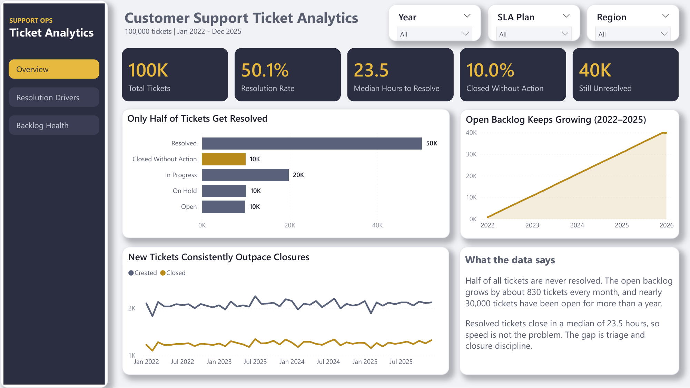
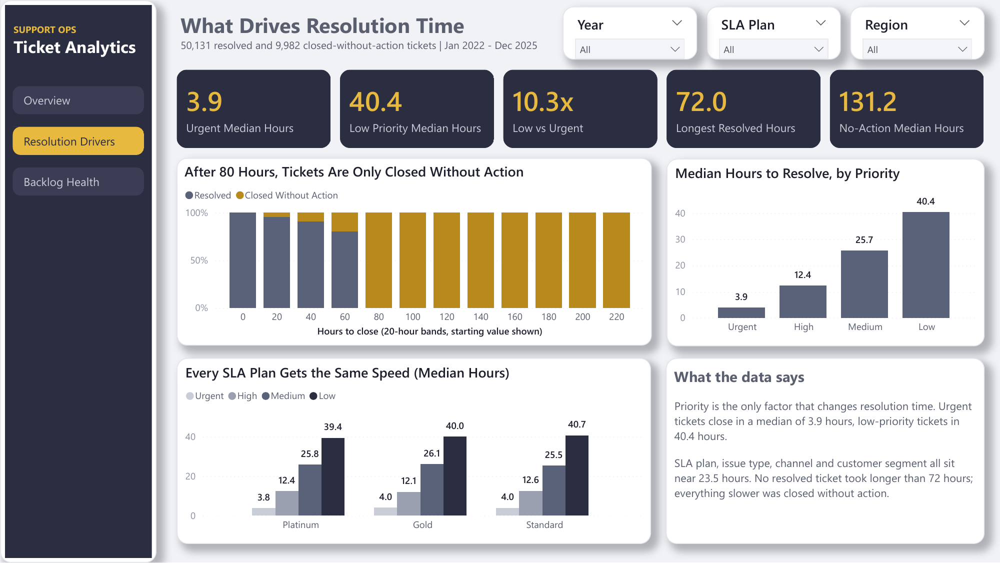
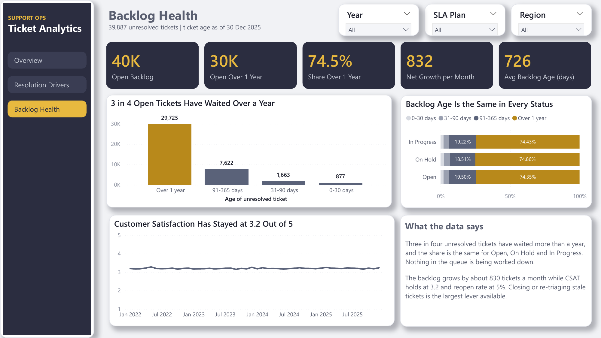

# Customer Support Ticket Analytics

End-to-end business intelligence project on 100,000 customer support tickets
(January 2022 – December 2025): raw CSV to PostgreSQL, SQL analysis, a star
schema in Power BI, and a three-page dashboard built to answer one question —
**why does this support operation have a backlog it cannot clear?**

The short answer: it is not speed. Tickets that get resolved close in a median
of 23.5 hours. The problem is that **half of all tickets are never resolved at
all**, and the queue has been growing by roughly 830 tickets every month for
four straight years.

---

## Headline findings

| Finding | Evidence |
|---|---|
| Only half of tickets are resolved | 50,131 resolved (50.1%), 9,982 closed without action (10.0%), 39,887 still open (39.9%) |
| The backlog grows every month | ~2,080 tickets created vs ~1,250 closed per month; backlog went from 883 to 39,931 |
| Three in four open tickets are over a year old | 29,725 of 39,887 unresolved tickets (74.5%) |
| Priority is the only real driver of speed | Median hours to resolve: urgent 3.9, high 12.4, medium 25.7, low 40.4 — a 10.3x spread |
| Paid SLA plans buy nothing | Platinum, Gold and Standard all sit at ~23.5 hours median, with an identical priority mix |
| "Slow" tickets are abandoned tickets, not slow work | No resolved ticket exceeded 72 hours; all 6,103 tickets above the 106.9-hour IQR fence are `closed_no_action` (median 131.2 hours) |

The practical consequence: measuring this team on *average resolution time*
makes them look fine while the queue quietly doubles. The metrics that matter
are median time per priority, abandonment rate, backlog age, and backlog growth.

---

## Stack

| Layer | Tool |
|---|---|
| Database | PostgreSQL 17 |
| Loading & querying | psql, pgAdmin 4 |
| Transformation | SQL (staging table → typed table → star schema) |
| Modelling & visualisation | Power BI Desktop (star schema, DAX, custom JSON theme) |
| Documentation | Microsoft Word |

---

## Repository structure

```
customer-support-ticket-analytics/
├── README.md
├── .gitignore
├── data/
│   └── README.md                     # how to obtain the raw dataset
├── sql/
│   ├── 01_load_and_verify.sql        # staging load, type casting, data quality checks
│   ├── 02_build_star_schema.sql      # dimensions, fact table, derived columns
│   └── 03_analysis_queries.sql       # every analysis query, one per business question
├── powerbi/
│   ├── ticket_analytics_powerbi.pbix # the dashboard
│   ├── measures_dax.txt              # all DAX measures, with formatting notes
│   └── midnight_gold_theme.json      # custom report theme
├── outputs/                          # CSV results exported from the analysis queries
├── images/                           # dashboard screenshots
└── docs/
    ├── 01_project_charter.docx       # scope, objectives, success metrics
    ├── 02_project_plan.docx          # phases, deliverables, timeline
    ├── 03_findings_report.docx       # full findings and recommendations
    └── 03_findings_report.pdf
```

---

## How to reproduce

**Prerequisites:** PostgreSQL 17 and Power BI Desktop.

1. **Create the database**

   ```sql
   CREATE DATABASE ticket_analytics;
   ```

2. **Load the raw data.** Place the source CSV in `data/raw/`, then run
   `sql/01_load_and_verify.sql`. It loads into an all-VARCHAR staging table
   first, then casts into a typed table — so a bad row fails at a visible step
   instead of silently becoming NULL.

   From `psql`, connect to the right database before loading:

   ```
   \c ticket_analytics
   \copy stg_tickets FROM 'data/raw/support_tickets.csv' CSV HEADER
   ```

3. **Build the star schema** with `sql/02_build_star_schema.sql`, then run the
   verification block at the end. Expected: 100,000 fact rows, 1,492 date rows,
   60,113 tickets with a close date, and 0 resolved tickets above the outlier
   fence.

4. **Run the analysis** with `sql/03_analysis_queries.sql`, exporting each
   result into `outputs/` using `\copy`.

5. **Open the dashboard.** `powerbi/ticket_analytics_powerbi.pbix` connects to
   PostgreSQL; point it at your own server under *Transform data → Data source
   settings*, then refresh.

---

## Data quality issues found and fixed

These are documented because every number downstream depends on them.

| Issue | What was actually happening | Fix |
|---|---|---|
| Date format | `created_at` is stored as ISO 8601. Excel *displays* it as dd/mm/yyyy, so a `TO_TIMESTAMP` mask built from the Excel view failed on every row | Cast directly with `::TIMESTAMP` |
| Missing decimals | Opening the CSV in Excel under an Indonesian locale strips the decimal point, turning `23.5` into `235` | Never clean through Excel; load the raw file into the staging table as text |
| Duplicate load | A re-run without truncating produced 200,000 rows | Truncate staging before every load, then verify the row count |
| Blank resolution time | 39,887 rows have no resolution time — not missing data, but tickets that were never closed | Keep them NULL and exclude them from duration measures rather than imputing zero |
| CSAT zeros | `csat_score = 0` on ~30% of rows, spread evenly across every status | Treat 0 as "not rated" via `NULLIF(csat_score, 0)` |

Two populations also had to be separated: tickets that were **resolved** and
tickets that were **closed without action**. Averaging them together is what
makes the operation look slow. Measured separately, resolved tickets have a
median of 23.5 hours and abandoned ones 131.2 hours.

---

## Data model

A star schema with one fact table and six dimensions:

- `fact_ticket` — one row per ticket, with derived columns for close date,
  duration, ticket age, age bucket, duration bucket, and an outlier flag
- `dim_date` — 2022-01-01 to 2026-01-31, with a second **inactive** relationship
  from `tanggal_tutup`, activated by `USERELATIONSHIP` inside the "tickets
  closed" measure so that created and closed can be charted on one axis
- `dim_priority`, `dim_status`, `dim_sla` — each carries a sort column so that
  urgent → low and the status groups order correctly instead of alphabetically
- `dim_issue`, `dim_product`

Ticket age is the whole-day difference between **30 December 2025** (the last
day in the data) and the creation date. Using timestamp arithmetic instead moves
boundary tickets between buckets, so age is always read from the
`kelompok_umur` column rather than recomputed ad hoc.

---

## Dashboard

Three pages, each answering one question.

**1. Overview — what is the state of the queue?**
Five KPIs (total tickets, resolution rate, median hours to resolve, closed
without action, still unresolved), cumulative backlog growth, ticket
composition by status, and created vs closed per month.

**2. Resolution Drivers — what decides how fast a ticket closes?**
Median hours by priority, median hours by SLA plan broken down by priority, and
a 100% stacked distribution of resolved vs abandoned tickets across 20-hour
bands — the chart that shows nothing past 80 hours was ever actually resolved.

**3. Backlog Health — how bad is the queue, and is it getting worse?**
Backlog by age bucket, age composition per status, and CSAT over time on a
fixed 1–5 axis so that normal fluctuation is not mistaken for a trend.

<!--
  Add screenshots to images/ and paste these three lines under each page heading:

  
  
  
-->

---

## Recommendations

1. Stop reporting average resolution time. Report median per priority,
   abandonment rate, backlog age, and backlog growth.
2. Separate resolved from closed-without-action in every report. They are two
   different populations and mixing them hides both problems.
3. Introduce a waiting-on-customer policy: automatic reminders at 24 and 48
   hours, automatic closure on day seven, and exclusion from resolution-time
   metrics.
4. Run a cleanup programme for the 29,725 tickets older than one year, with
   explicit closure rules so the backlog does not rebuild.
5. Fix triage. Priority currently has no relationship to issue type or to the
   SLA plan the customer pays for, yet it is the only thing that changes how
   fast a ticket is handled.

---

## Limitations

- **The dataset is synthetic.** Volume is almost perfectly uniform across
  region, platform, channel, product area and customer segment. Priority is the
  only attribute with real signal. The project demonstrates correct method; it
  does not describe a real company.
- No first-response timestamp, so first-response time cannot be calculated.
- No per-plan SLA targets, so SLA breaches cannot be measured — plans can only
  be compared against each other.
- No agent or cost fields, so productivity and cost analysis are out of scope.
- CSAT is unrated on ~30% of rows; averages are computed on rated tickets only.

---

## Author

**Marco Alexander** — Information Systems, BINUS University
[linkedin.com/in/marcolex](https://linkedin.com/in/marcolex)
